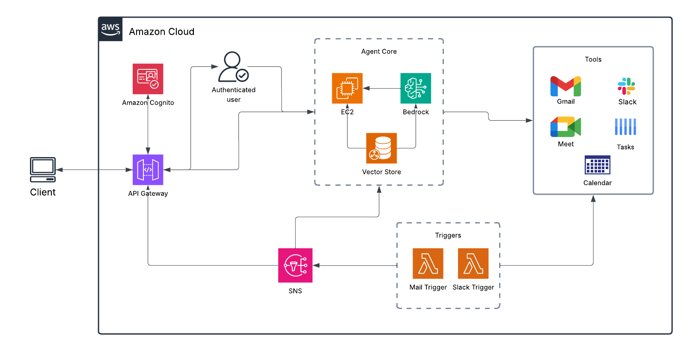

# CPAA – Configurable Personal AI Agent

## Description

CPAA (Configurable Personal AI Agent) is a personal productivity assistant that connects with daily tools such as **Gmail, Google Calendar, Google Meet, and Slack**.
It helps manage **tasks, reminders, and to-do lists** by automatically extracting action items from emails, meetings, and chats.
The agent is **configurable**, allowing users to set custom rules and workflows to suit their individual needs.

---

## Features

* **Integrations**

  * Gmail → Convert important emails into tasks
  * Google Calendar → Sync deadlines and meeting reminders
  * Google Meet → Capture meeting notes and auto-generate tasks
  * Slack → Turn messages into to-do items

* **Task Management**

  * Unified to-do list from multiple sources
  * Automatic reminders and smart notifications
  * Prioritization of tasks based on rules

* **Configurable Agent**

  * Rule-based task creation (e.g., mark `urgent` emails as high priority)
  * Easy integration with future platforms

---

## Architecture

---